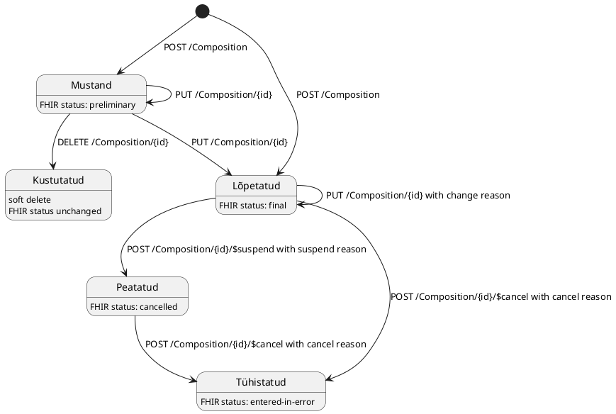

Käesolevas juhendis kirjeldatakse HCERT teenuse poolt toetatud FHIR otspunktid ja operatsioonid. Toodud näidispäringud ja näidisvastused ei kajasta reaalseid
andmeid aga vastavad oodatud/toetatud
ressursi struktuurile.

Masinloetav FHIR serveri API kirjeldus ehk FHIR CapabilityStatement on kättesaadav **URL**: `GET [base]/metadata` kaudu.

### Olekute diagramm

Diarammil on toodud lubatud liigutused Tervisetõendi olekute vahel, FHIR ressursi staatused ning HTTP operatsioonid.



### Tervisetõendi loomine

Tervisetõendi loomine on kasutusala spetsiifiline, vastavalt kasutusalale tuleb saata Composition ressurss õige [profiiliga](profiles.html).
Profiil määrab mis ressursi väljad on kohustuslikud, nende eesmärki ja struktuuri.

[Artifaktide](artifacts.html) leheküljel on toodud ka ressurside [näidised](artifacts.html#example-example-instances).

#### Päring

**URL**: `POST [base]/Composition`



#### Vastus

- **HTTP status**: 201 Created
- **Sisu**: Päringu päise parameetri `Prefer: return=representation` korral tagastatakse loodud tervisetõend (Composition ressurss) vastuse kehas.

```
HTTP/1.1 201 Created
Location: [base]/Composition/500/_history/1
```

### Tervisetõendi uuendamine

#### Päring

**URL**: `PUT [base]/Composition/500`



#### Vastus

- **HTTP status**: 200 OK
- **Sisu**: Päringu päise parameetri `Prefer: return=representation` korral tagastatakse uuendatud tervisetõend (Composition ressurss) vastuse kehas.



### Tervisetõendi pärimine

#### Päring

**URL**: `GET [base]/Composition/500`

#### Vastus

- **HTTP status**: 200 OK



### Tervisetõendi ajalugu pärimine

#### Päring

**URL**: `GET [base]/Composition/500/_history/1`

#### Vastus

- **HTTP status**: 200 OK



### Tervisetõendi kustutamine

Tõendi kustutamine on võimalik vaid **Mustand** olekust. Kustutatud ressurss on kättesaadav ajaloost aga id järgi laadides ega otsinguga pole kättesaadav.

#### Päring

**URL**: `DELETE [base]/Composition/500`

#### Vastus

- **HTTP status**: 204 No Content

### Tervisetõendi peatamine

Tõendi peatamine tehakse [$suspend](OperationDefinition-ee-health-certificate-suspend.html) operatsiooniga.

### Tervisetõendi tühistamine

Tõendi tühistamine tehakse [$cancel](OperationDefinition-ee-health-certificate-suspend.html) operatsiooniga.

### Tervisetõendi otsing

Otsing on implementeeritud FHIR standardi järgi: https://hl7.org/fhir/search.html

#### Toetatud otsinguparameetrid

| Parameeter                           | Kirjeldus                                                                                                                 | Väärtustatud näidis                                                     |   
|--------------------------------------|---------------------------------------------------------------------------------------------------------------------------|-------------------------------------------------------------------------|
| _count                               | Mitu tulemust tagastada lehel, vaikimisi 10. Ülemine piir on 100                                                          | _count=5                                                                |
| _page                                | Lehe number mida tagastada                                                                                                | _page=1                                                                 |
| _sort                                | Väli mille järgi sorteerida ja suund, võib olla mitu                                                                      | _sort=-date                                                             |
| subject:Patient.identifier           | Patsiendi identifikaator kujul "system\|value", eraldaja sümbol peab olema URL encode-itud. Võimalusel kasutada _subject_ | subject:Patient.identifier=https://fhir.ee/sid/pid/est/ni%7C37412251234 |
| subject                              | MPI patsiendi id. Eelisatud variant patsiendi identifitseerimiseks otsingus                                               | subject=Patient/123                                                     |
| status                               | Tõendi staatus                                                                                                            | status=final                                                            |
| category                             | Tervisetõendi kasutusala                                                                                                  | category=driver-group-I                                                 |
| section-code-text                    | Tööandja asutus. Lubatud formaat employer$XXXXXX, kus XXXXXX on asutuse Äriregistri kood                                  | section-code-text=employer$16978044                                     |
| author:PractitionerRole.practitioner | Autori isikukoodi                                                                                                         | author:PractitionerRole.practitioner=Practitioner/38912042211           |
| author:PractitionerRole.organization | Autori asutuse kood (Äriregistri kood)                                                                                    | author:PractitionerRole.organization=Organization/1234567               |
| entry                                | Tervisedeklaratsiooni id                                                                                                  | entry=QuestionnaireResponse/1234                                        |
| period                               | Kehtivus. Rakendus kontrollib kas antud kuupäev kuulub tõendi kehtivuse perioodi alla                                     | period=2025-01-12                                                       |

#### Päring

**URL**: `GET [base]/Composition?{param1}={value1}&...`

#### Vastus

- **HTTP status**: 200 OK

```json
{
  "resourceType": "Bundle",
  "type": "searchset",
  "total": 35,
  "link": [
    {
      "relation": "self",
      "url": "[base]/Composition?subject=Patient/582278&_sort=-date&_page=1"
    },
    {
      "relation": "first",
      "url": "[base]/Composition?subject=Patient/582278&_sort=-date&_page=1"
    },
    {
      "relation": "last",
      "url": "[base]/Composition?subject=Patient/582278&_sort=-date&_page=4"
    },
    {
      "relation": "next",
      "url": "[base]/Composition?subject=Patient/582278&_sort=-date&_page=2"
    }
  ],
  "entry": [
    {
      "fullUrl": "Composition/20695",
      "resource": {
        "resourceType": "Composition",
        "id": "20695",
        "meta": {
          "versionId": "3",
          "lastUpdated": "2025-05-19T10:24:51.113+03:00",
          "profile": [
            "https://fhir.ee/hcert/StructureDefinition/ee-health-certificate-driver"
          ]
        },
        "contained": [
          ...
        ],
        ...
        "subject": [
          {
            "reference": "Patient/582278/_history/1"
          }
        ],
        "date": "2025-05-19T03:00:00+03:00",
        ...
      }
    },
    {
      "fullUrl": "Composition/20700",
      "resource": {
        "resourceType": "Composition",
        "id": "20700",
        "meta": {
          "versionId": "1",
          "lastUpdated": "2025-05-19T20:24:51.113+03:00",
          "profile": [
            "https://fhir.ee/hcert/StructureDefinition/ee-health-certificate-occupational"
          ]
        },
        "contained": [
          ...
        ],
        ...
        "subject": [
          {
            "reference": "Patient/582278/_history/1"
          }
        ],
        "date": "2025-05-19T03:00:00+03:00",
        ...
      }
    }
    ...
  ]
}
```

### Tervisetõendi ligipääsu pärimine

Tõendi ligipääsu pärimine tehakse [$get-consent](OperationDefinition-ee-health-certificate-get-consent.html) operatsiooniga.

### Tervisetõendi ligipääsu muutmine

Tõendi ligipääsu muutmine tehakse [$set-consent](OperationDefinition-ee-health-certificate-set-consent.html) operatsiooniga.


### Vead

API tagastab vead [OperationOutcome](https://hl7.org/fhir/R5/operationoutcome.html) ressursina mille sees võib olla mitu `issue` elementi koos vigadega.
HCERT enda vead tulevad süsteemiga `https://hcert.tehik.ee/issue`, vastus aga võib sisalda ka teiste teenuste (teise süsteemiga) vead.

Näide `OperationOutcome`-ist:

```json
{
  "resourceType": "OperationOutcome",
  "text": {
    "status": "generated",
    "div": "<div xmlns=\"http://www.w3.org/1999/xhtml\">\n<dt>HCERT-008</dt><dd>Could not find unique patient by https://tehik.ee/mpi/external-reference|123</dd>\n</div>"
  },
  "issue": [
    {
      "id": "4355b879-d490-47ee-be13-21239616bde6",
      "severity": "error",
      "code": "invalid",
      "details": {
        "coding": [
          {
            "system": "https://hcert.tehik.ee/issue",
            "code": "HCERT-008"
          }
        ],
        "text": "Could not find unique patient by https://tehik.ee/mpi/external-reference|123"
      }
    }
  ]
}
```
